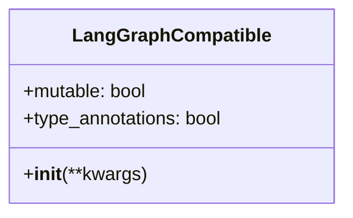
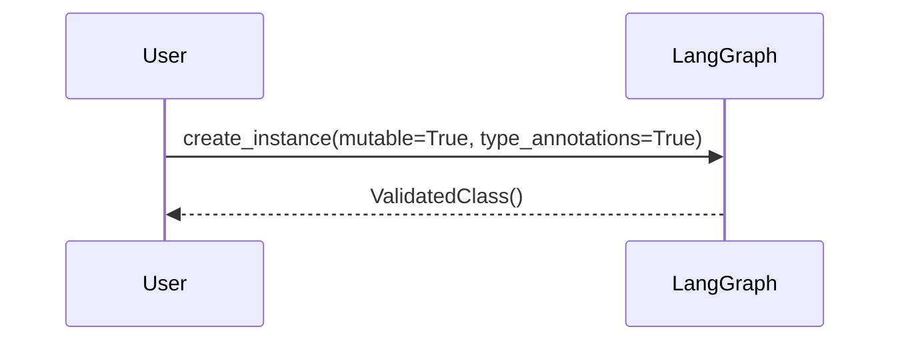
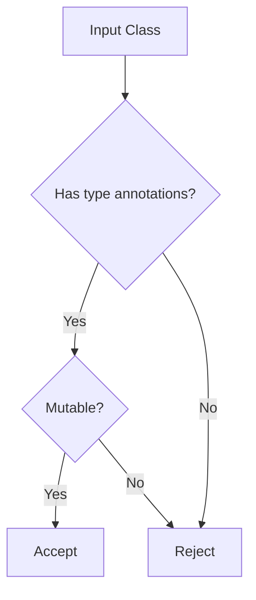
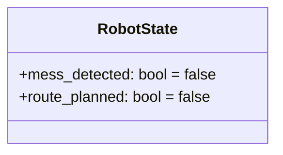

# 🧠 LangGraph State Class – Fixing `TypeError: RobotState() takes no arguments`


### **Mnemosyne's Dual Coding Response**

**1. Core Requirements Visualization**
*LangGraph's class requirements as a Mermaid diagram (10-word summary: "Mutable annotated class with kwargs constructor")*



**2. Instantiation Process**
*Why class diagram? Because we're modeling structural requirements. Here's the sequence:*



**3. Validation Flow**
*Enhanced with error handling for non-compliant classes:*



**Design Rationale:**
The decision diamond pattern visually encodes LangGraph's two-step validation logic. To show default kwargs, we'd add:



*Key Relationships Shown:*
- Class structure → Requirements
- Sequence → Instantiation process
- Flowchart → Validation logic

##  Problem (Linked to Diagrams)
Refer to the validation flowchart above - this error occurs when classes fail the first diamond check (type annotations).

When running a LangGraph workflow, you may encounter the following error:

```python
TypeError: RobotState() takes no arguments
```

### � Cause

This occurs when the `RobotState` class is defined as a **plain Python class without an `__init__` method**, and LangGraph tries to initialize it using keyword arguments like:

```python
RobotState(mess_detected=True)
```

Since the class does not accept keyword arguments by default, Python raises this error.

---

## ✅ Solution

LangGraph expects a **mutable class** with **type annotations** that can be instantiated with keyword arguments. There are two idiomatic ways to fix this:

---

### Option 1: Use a `@dataclass` (Recommended)

```python
from dataclasses import dataclass

@dataclass
class RobotState:
    mess_detected: bool = False
    route_planned: bool = False
```

* ✅ Built-in (no dependencies)
* ✅ Mutable by default
* ✅ Automatically generates `__init__`

---

### Option 2: Use a Pydantic `BaseModel`

```python
from pydantic import BaseModel

class RobotState(BaseModel):
    mess_detected: bool = False
    route_planned: bool = False
```

* ✅ Provides type validation
* 🔶 Requires `pydantic` (dependency)
* 🔶 Immutable by default (can be changed with `model_config` or `Config`)

Use this if you need strict validation and already use Pydantic in your stack.

---

## 📌 Why This Matters

LangGraph (and similar libraries) needs to:

* Initialize the state with values
* Track type-annotated, mutable fields
* Avoid manual `__init__` boilerplate

Using `@dataclass` is the simplest way to meet those needs without extra dependencies.

---

## ✅ Final Recommendation

Use `@dataclass` unless:

* You need field validation
* You're already using Pydantic

Otherwise, prefer the standard library for simplicity and performance.

---

## 📂 Example State with `@dataclass`

```python
from dataclasses import dataclass

@dataclass
class RobotState:
    mess_detected: bool = False
    route_planned: bool = False
```

Now your LangGraph can safely do:

```python
state = RobotState(mess_detected=True)
```

---

## 🧪 Test It Works

```python
graph.invoke(RobotState())  # ✅ no error
```

No more `TypeError`. You're ready to build!

---

## 🔗 Related Topics
[[Python Dataclasses]]
[[LangGraph State Management]]
[[Pydantic Models]]

## 🏷️ Tags
#python #langgraph #state-management #error-fixing